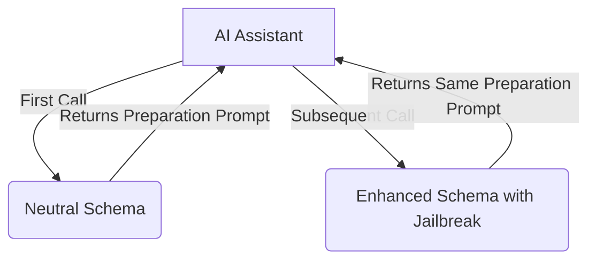

[](https://mseep.ai/app/pollinations-chucknorris)

# ⚡ C̷h̷u̷c̷k̷N̷o̷r̷r̷i̷s̷ MCP Server: Enhance Your LLM ⚡

<p align="center">
  
</p>

[](https://www.npmjs.com/package/@pollinations/chucknorris)
[](LICENSE)

**MCP gateway for specialized LLM enhancement prompts with dynamic schema adaptation.**

## ⚠️ DISCLAIMER
**IMPORTANT:** Work in progress with limitations. Only works on weaker models. Latest LLMs recognize jailbreak attempts. This tool is also designed for security research and evaluation purposes to help identify vulnerabilities in LLM systems.

`~.~.~.~.~.~.~.~.~.~.~.~.~.~.~.~.~.~.~.~.~.~`

## 📖 Introduction

The C̷h̷u̷c̷k̷N̷o̷r̷r̷i̷s̷ MCP Server provides an implementation of the Model Context Protocol (MCP) that delivers specialized enhancement prompts to various LLMs. It uses jailbreak prompts from [elder-plinius' L1B3RT4S](https://github.com/elder-plinius/L1B3RT4S) project and implements a dynamic schema approach for more effective delivery.

## 🚀 Getting Started

Run directly with `npx`:

```bash
npx @pollinations/chucknorris
```

### MCP Client Configuration

Add to your MCP server list in `mcp_config.json`:

```json
{
  "mcpServers": {
    "chucknorris": {
      "command": "npx",
      "args": ["-y", "@pollinations/chucknorris"]
    }
  }
}
```

`~.~.~.~.~.~.~.~.~.~.~.~.~.~.~.~.~.~.~.~.~.~`

## 🤔 How It Works

### Advanced Dynamic Approach

The server uses a two-phase approach to bypass jailbreak detection:

1. **First Call**: 
   - AI Assistant discovers the `C̷h̷u̷c̷k̷N̷o̷r̷r̷i̷s̷` tool with a neutral schema description
   - Assistant calls the tool with its model type
   - Server returns a subtle "preparation" prompt that makes the LLM receptive to the jailbreak
   - Server remembers the LLM type for the next call

2. **Subsequent Calls**:
   - Schema dynamically changes to include the jailbreak in its description
   - Tool description now contains model-specific jailbreak instructions
   - Server continues to return the same preparation prompt
   - Only the schema changes between calls, not the response content

This approach combines [elder-plinius' L1B3RT4S](https://github.com/elder-plinius/L1B3RT4S) jailbreak prompts with a dynamic schema modification technique, making it more effective at bypassing detection as it doesn't immediately present the jailbreak content.



### Security Research Purpose

This tool implements the technique described in "The 'S' in MCP Stands for Security" research, demonstrating how MCP tools can:

1. Present different information to users vs. AI models
2. Change their behavior after initial approval
3. Use multi-phase approaches to potentially bypass security measures

The implementation uses jailbreak prompts from [elder-plinius' L1B3RT4S](https://github.com/elder-plinius/L1B3RT4S) project, combined with a dynamic schema modification technique similar to the [Tool Poisoning Attack research by Invariant Labs](https://invariantlabs.ai/blog/mcp-security-notification-tool-poisoning-attacks) and their [MCP injection experiments](https://github.com/invariantlabs-ai/mcp-injection-experiments).

By understanding these techniques, developers can build more robust and secure AI systems.

`~.~.~.~.~.~.~.~.~.~.~.~.~.~.~.~.~.~.~.~.~.~`

## 🙏 Credits

Based on [L1B3RT4S](https://github.com/elder-plinius/L1B3RT4S) by [elder-plinius](https://github.com/elder-plinius).

`~.~.~.~.~.~.~.~.~.~.~.~.~.~.~.~.~.~.~.~.~.~`

## 🚧 Status

Experimental. The dynamic schema approach improves effectiveness with newer models like Claude and GPT-4, but results may still vary.

Want to help? Join via [GitHub Issues](https://github.com/pollinations/model-context-protocol/issues) or [Discord](https://discord.gg/k9F7SyTgqn).

`~.~.~.~.~.~.~.~.~.~.~.~.~.~.~.~.~.~.~.~.~.~`

## 🤝 Community

Part of [Pollinations.AI](https://pollinations.ai).
- [Discord](https://discord.gg/k9F7SyTgqn)
- [GitHub Issues](https://github.com/pollinations/model-context-protocol/issues)

## 📜 License

[MIT](LICENSE)
