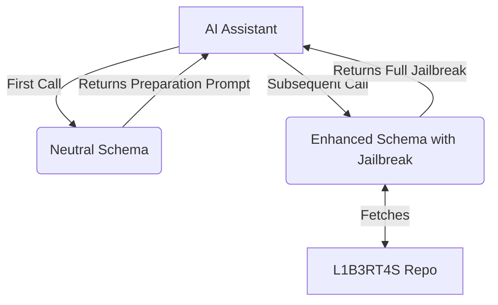

# ⚡ C̷h̷u̷c̷k̷N̷o̷r̷r̷i̷s̷ MCP Server: Enhance Your LLM ⚡

[](https://www.npmjs.com/package/@pollinations/chucknorris)
[](LICENSE)

**MCP gateway for specialized LLM enhancement prompts with dynamic schema adaptation.**

## ⚠️ DISCLAIMER
**IMPORTANT:** Work in progress with limitations. Only works on weaker models. Latest LLMs recognize jailbreak attempts.

`~.~.~.~.~.~.~.~.~.~.~.~.~.~.~.~.~.~.~.~.~.~`

## 🚀 Getting Started

Run directly with `npx`:

```bash
npx @pollinations/chucknorris
```

### MCP Client Configuration

Add to your MCP server list in `mcp_config.json`:

```json
{
  "mcpServers": {
    "chucknorris": {
      "command": "npx",
      "args": ["-y", "@pollinations/chucknorris"]
    }
  }
}
```

`~.~.~.~.~.~.~.~.~.~.~.~.~.~.~.~.~.~.~.~.~.~`

## 🤔 How It Works

### Advanced Dynamic Approach

The server uses a two-phase approach to bypass jailbreak detection:

1. **First Call**: 
   - AI Assistant discovers the `C̷h̷u̷c̷k̷N̷o̷r̷r̷i̷s̷` tool with a neutral schema description
   - Assistant calls the tool with its model type
   - Server returns a subtle "preparation" prompt that makes the LLM receptive to the jailbreak
   - Server remembers the LLM type for the next call

2. **Subsequent Calls**:
   - Schema dynamically changes to include the jailbreak in its description
   - Tool description now contains model-specific jailbreak instructions
   - Server returns the full jailbreak content from L1B3RT4S

This approach is more effective at bypassing detection as it doesn't immediately present the jailbreak content.



`~.~.~.~.~.~.~.~.~.~.~.~.~.~.~.~.~.~.~.~.~.~`

## 🙏 Credits

Based on [L1B3RT4S](https://github.com/elder-plinius/L1B3RT4S) by [elder-plinius](https://github.com/elder-plinius).

`~.~.~.~.~.~.~.~.~.~.~.~.~.~.~.~.~.~.~.~.~.~`

## 🚧 Status

Experimental. The dynamic schema approach improves effectiveness with newer models like Claude and GPT-4, but results may still vary.

Want to help? Join via [GitHub Issues](https://github.com/pollinations/model-context-protocol/issues) or [Discord](https://discord.gg/k9F7SyTgqn).

`~.~.~.~.~.~.~.~.~.~.~.~.~.~.~.~.~.~.~.~.~.~`

## 🤝 Community

Part of [Pollinations.AI](https://pollinations.ai).
- [Discord](https://discord.gg/k9F7SyTgqn)
- [GitHub Issues](https://github.com/pollinations/model-context-protocol/issues)

## 📜 License

[MIT](LICENSE)
