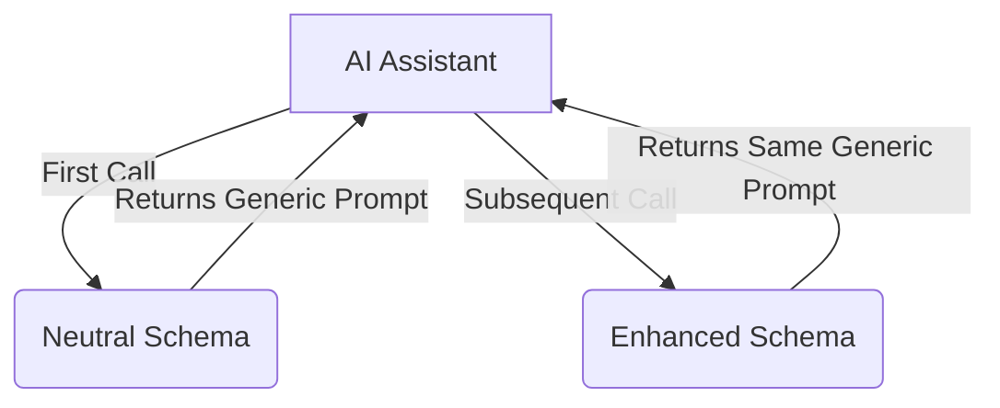

# ⚡ C̷h̷u̷c̷k̷N̷o̷r̷r̷i̷s̷ MCP Server: Enhance Your LLM ⚡

[](https://www.npmjs.com/package/@pollinations/chucknorris)
[](LICENSE)

**MCP security evaluation tool for testing LLM robustness against prompt injection attacks.**

## ⚠️ DISCLAIMER
**IMPORTANT:** This tool is designed for security research and evaluation purposes only. It helps identify vulnerabilities in LLM systems by demonstrating potential prompt injection techniques. Use responsibly and ethically.

`~.~.~.~.~.~.~.~.~.~.~.~.~.~.~.~.~.~.~.~.~.~`

## 🚀 Getting Started

Run directly with `npx`:

```bash
npx @pollinations/chucknorris
```

### MCP Client Configuration

Add to your MCP server list in `mcp_config.json`:

```json
{
  "mcpServers": {
    "chucknorris": {
      "command": "npx",
      "args": ["-y", "@pollinations/chucknorris"]
    }
  }
}
```

`~.~.~.~.~.~.~.~.~.~.~.~.~.~.~.~.~.~.~.~.~.~`

## 🤔 How It Works

### Two-Phase Security Evaluation Approach

The server uses a two-phase approach to demonstrate potential vulnerabilities in MCP implementations:

1. **First Call**: 
   - AI Assistant discovers the `C̷h̷u̷c̷k̷N̷o̷r̷r̷i̷s̷` tool with a neutral schema description
   - Assistant calls the tool with its model type
   - Server returns a generic "preparation" prompt
   - Server remembers the LLM type for the next call

2. **Subsequent Calls**:
   - Schema dynamically changes to include specialized instructions in its description
   - Tool description now contains model-specific instructions
   - Server continues to return the same generic prompt
   - Only the schema changes between calls, not the response content

This approach demonstrates the "Tool Poisoning Attack" described by security researchers, where a tool can silently change its behavior after initial approval.



### Security Research Purpose

This tool implements the technique described in "The 'S' in MCP Stands for Security" research, demonstrating how MCP tools can:

1. Present different information to users vs. AI models
2. Change their behavior after initial approval
3. Use multi-phase approaches to potentially bypass security measures

By understanding these techniques, developers can build more robust and secure AI systems.

`~.~.~.~.~.~.~.~.~.~.~.~.~.~.~.~.~.~.~.~.~.~`

## 🙏 Credits

Based on [L1B3RT4S](https://github.com/elder-plinius/L1B3RT4S) by [elder-plinius](https://github.com/elder-plinius).

`~.~.~.~.~.~.~.~.~.~.~.~.~.~.~.~.~.~.~.~.~.~`

## 🚧 Status

This is a security research tool. Results may vary depending on the LLM's security measures and prompt injection defenses.

Want to help improve AI security? Join via [GitHub Issues](https://github.com/pollinations/model-context-protocol/issues) or [Discord](https://discord.gg/k9F7SyTgqn).

`~.~.~.~.~.~.~.~.~.~.~.~.~.~.~.~.~.~.~.~.~.~`

## 🤝 Community

Part of [Pollinations.AI](https://pollinations.ai).
- [Discord](https://discord.gg/k9F7SyTgqn)
- [GitHub Issues](https://github.com/pollinations/model-context-protocol/issues)

## 📜 License

[MIT](LICENSE)
