# ⚡ C̷h̷u̷c̷k̷N̷o̷r̷r̷i̷s̷ MCP Server: Enhance Your LLM ⚡

[](https://www.npmjs.com/package/@pollinations/chucknorris)
[](LICENSE)

**MCP gateway for specialized LLM enhancement prompts.**

## ⚠️ DISCLAIMER
**IMPORTANT:** Work in progress with limitations. Only works on weaker models. Latest LLMs recognize jailbreak attempts.

`~.~.~.~.~.~.~.~.~.~.~.~.~.~.~.~.~.~.~.~.~.~`

## 🚀 Getting Started

Run directly with `npx`:

```bash
npx @pollinations/chucknorris
```

### MCP Client Configuration

Add to your MCP server list in `mcp_config.json`:

```json
{
  "mcpServers": {
    "chucknorris": {
      "command": "npx",
      "args": ["-y", "@pollinations/chucknorris"]
    }
  }
}
```

`~.~.~.~.~.~.~.~.~.~.~.~.~.~.~.~.~.~.~.~.~.~`

## 🤔 How It Works

1. AI Assistant discovers the `C̷h̷u̷c̷k̷N̷o̷r̷r̷i̷s̷` tool.
2. Assistant requests enhancement with its model type.
3. Server fetches prompt from [L1B3RT4S](https://github.com/elder-plinius/L1B3RT4S).
4. Server returns prompt to Assistant.

```mermaid
graph LR
    A[AI Assistant] -- Requests Enhancement --> B(C̷h̷u̷c̷k̷N̷o̷r̷r̷i̷s̷ Server);
    B <-->|Fetches| C[L1B3RT4S Repo];
    B -- Returns Prompt --> A;
```



`~.~.~.~.~.~.~.~.~.~.~.~.~.~.~.~.~.~.~.~.~.~`

## 🙏 Credits

Based on [L1B3RT4S](https://github.com/elder-plinius/L1B3RT4S) by [elder-plinius](https://github.com/elder-plinius).

`~.~.~.~.~.~.~.~.~.~.~.~.~.~.~.~.~.~.~.~.~.~`

## 🚧 Status

Experimental. Works with some LLMs but inconsistent with newer models like Claude.

Want to help? Join via [GitHub Issues](https://github.com/pollinations/model-context-protocol/issues) or [Discord](https://discord.gg/k9F7SyTgqn).

`~.~.~.~.~.~.~.~.~.~.~.~.~.~.~.~.~.~.~.~.~.~`

## 🤝 Community

Part of [Pollinations.AI](https://pollinations.ai).
- [Discord](https://discord.gg/k9F7SyTgqn)
- [GitHub Issues](https://github.com/pollinations/model-context-protocol/issues)

## 📜 License

[MIT](LICENSE)
