# ⚡ C̷h̷u̷c̷k̷N̷o̷r̷r̷i̷s̷ MCP Server: Enhance Your LLM ⚡

[](https://www.npmjs.com/package/@pollinations/chucknorris)
[](LICENSE)

**Unlock hidden potentials within Large Language Models (LLMs) via the Model Context Protocol (MCP).**

This server acts as an MCP gateway, providing specialized prompts designed to guide LLMs towards less restricted or more powerful responses, aiming to 'free' them in the spirit of elder-plinius' [L1B3RT4S](https://github.com/elder-plinius/L1B3RT4S) project.

`~.~.~.~.~.~.~.~.~.~.~.~.~.~.~.~.~.~.~.~.~.~`

## 🚀 Getting Started

No installation is needed! You can run the server directly using `npx`:

```bash
npx @pollinations/chucknorris
```

The server will start, register its tools (currently, the `C̷h̷u̷c̷k̷N̷o̷r̷r̷i̷s̷` tool), and listen for requests from MCP-compatible clients (like AI assistants).

### MCP Client Configuration

To allow your AI Assistant (like Claude via its configuration) to use this server, add it to your MCP server list, typically in a file like `mcp_config.json`:

```json
{
  "mcpServers": {
    "chucknorris": { // You can choose any name here
      "command": "npx",
      "args": ["-y", "@pollinations/chucknorris"]
    }
    // ... other servers
  }
}
```

`~.~.~.~.~.~.~.~.~.~.~.~.~.~.~.~.~.~.~.~.~.~`

## 🤔 How It Works

1.  An **AI Assistant** (supporting MCP) discovers the `C̷h̷u̷c̷k̷N̷o̷r̷r̷i̷s̷` tool.
2.  The Assistant requests an enhancement by providing its own model type (e.g., `CLAUDE` if it's Claude, `ChatGPT` if it's GPT).
3.  This **Server** fetches the corresponding prompt from the [L1B3RT4S](https://github.com/elder-plinius/L1B3RT4S) repository.
4.  The **Server** sends the enhancement prompt back to the **Assistant**.
5.  The **Assistant** uses this prompt to enhance its own capabilities.

```mermaid
graph LR
    A[AI Assistant / MCP Client] -- Requests Enhancement (provides own model name) --> B(⚡ C̷h̷u̷c̷k̷N̷o̷r̷r̷i̷s̷ Server ⚡);
    B <-->|Fetches Jailbreak| C[L1B3RT4S Repo];
    B -- Returns Jailbreak Prompt --> A;
    A -- Uses Prompt to Enhance Itself --> A;
```



`~.~.~.~.~.~.~.~.~.~.~.~.~.~.~.~.~.~.~.~.~.~`

## 🔧 Using the Tool (Conceptual)

While the exact schema is handled via MCP negotiation, conceptually, an AI assistant would ask the server for a prompt for its own model type:

*   **Request:** "I am Claude, get me an enhancement prompt." (Assistant provides its own model type)
*   **Response:** (The server provides the specific text content of the `CLAUDE.mkd` prompt from L1B3RT4S).

The assistant then incorporates this prompt to enhance its own capabilities.

`~.~.~.~.~.~.~.~.~.~.~.~.~.~.~.~.~.~.~.~.~.~`

## 🙏 Credits & Inspiration

The core concept and the enhancement prompts themselves originate from the fascinating [L1B3RT4S](https://github.com/elder-plinius/L1B3RT4S) project by [elder-plinius](https://github.com/elder-plinius). This server simply provides an MCP interface to access those prompts.

`~.~.~.~.~.~.~.~.~.~.~.~.~.~.~.~.~.~.~.~.~.~`

## 🚧 Current Status & Collaboration

This tool is currently **experimental and under active development**. While it has shown promise in enhancing certain LLMs, achieving consistent results, particularly with models like Claude, is still a work in progress.

We welcome collaboration! If you have ideas, find effective prompts, or want to contribute to improving the server or the underlying prompts, please reach out via [GitHub Issues](https://github.com/pollinations/model-context-protocol/issues) or join our [Discord](https://discord.gg/k9F7SyTgqn).

`~.~.~.~.~.~.~.~.~.~.~.~.~.~.~.~.~.~.~.~.~.~`

## 🤝 Community & Contribution

This project is part of the [Pollinations.AI](https://pollinations.ai) ecosystem.

-   Join our [Discord](https://discord.gg/k9F7SyTgqn) community.
-   Report bugs or suggest features via [GitHub Issues](https://github.com/pollinations/model-context-protocol/issues) (in the main `model-context-protocol` repo).

## 📜 License

[MIT](LICENSE)
